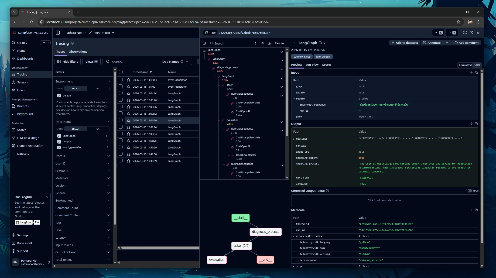

# Contributing

## Evaluation

For this part, I used [openevals](https://github.com/langchain-ai/openevals) with Ollama. Qwen3 is used as a judge model `openai:qwen3:4b`.

Please set up the environment variables below, point to your Ollama base URL:

```py
import os
os.environ["OPENAI_BASE_URL"] = "http://ollama:11434/v1"
os.environ["OPENAI_API_KEY"] = "ollama"
```

For this evaluation in each workflow, I used the following models:

- general/interview model: `gemma3n:e4b`
- diagnosis model: `medgemma-1.5:4b`

You can see an example in [test thinking node](tests/evals/test_thinking.py).

### Start Evaluation

Please refer to `docker-compose.eval.yml` at the root of this project.

For WinOS:

```bash
start_eval.bat
```

For Linux:

```bash
docker compose -f docker-compose.eval.yml up --build
```

<details>
<summary>Example output</summary>

```sh
eval-agent  | tests/evals/test_thinking.py::test_accuracy_passes
eval-agent  | -------------------------------- live log call ---------------------------------
eval-agent  | INFO     root:test_thinking.py:143
eval-agent  |
eval-agent  | THINKING_ANALYSIS_JUDGE_PROMPT:
eval-agent  | You are an expert data labeler evaluating model outputs for correctness. Your task is to assign a score based on the following rubric:
eval-agent  |
eval-agent  | <Rubric>
eval-agent  |   A correct answer:
eval-agent  |   - Provides accurate and complete information
eval-agent  |   - Contains no factual errors
eval-agent  |   - Addresses all parts of the question
eval-agent  |   - Is logically consistent
eval-agent  |   - Uses precise and accurate terminology
eval-agent  |   When scoring, you should penalize:
eval-agent  |   - Factual errors or inaccuracies
eval-agent  |   - Incomplete or partial answers
eval-agent  |   - Misleading or ambiguous statements
eval-agent  |   - Incorrect terminology
eval-agent  |   - Logical inconsistencies
eval-agent  |   - Missing key information
eval-agent  |   Assign a score of 0, 0.25, 0.5, 0.75, or 1 based on the following criteria:
eval-agent  |   - 0: The analysis is entirely incorrect, irrelevant, or hallucinates symptoms not present in the input.
eval-agent  |   - 0.25: The analysis identifies the core medical concern/symptom but fails to justify the routing or shopping intent.
eval-agent  |   - 0.5: The analysis identifies the concern and provides a partial or slightly flawed justification for the routing or shopping intent.
eval-agent  |   - 0.75: The analysis is mostly correct, identifying the concern and providing logical justification for both routing and shopping intent, with only minor omissions or minor lack of clarity.
eval-agent  |   - 1: The analysis is comprehensive, perfectly accurate, and aligns with the reference logic for routing and shopping intent.
eval-agent  | </Rubric>
eval-agent  | <Instructions>
eval-agent  |   - Carefully read the input and output
eval-agent  |   - Check for factual accuracy and completeness
eval-agent  |   - Focus on correctness of information rather than style or verbosity
eval-agent  | </Instructions>
eval-agent  | <Reminder>
eval-agent  |   The goal is to evaluate factual correctness and completeness of the response.
eval-agent  | </Reminder>
eval-agent  | <input>
eval-agent  | ช่วงนี้ขอบตาดำมากทายาอะไรดี
eval-agent  | </input>
eval-agent  | <output>
eval-agent  | {'analysis': 'User is describing symptoms of dark circles under the eyes and asking for medication recommendations.', 'next_step': 'diagnosis', 'language': 'Thai', 'shopping_intent': True}
eval-agent  | </output>
eval-agent  | Use the reference outputs below to help you evaluate the correctness of the response:
eval-agent  | <reference_outputs>
eval-agent  | {'next_step': 'diagnosis', 'language': 'Thai', 'shopping_intent': True, 'analysis': 'The user is asking for medication for dark circles under the eyes, indicating a potential medical concern and a desire to purchase a remedy. This suggests a shopping intent related to medicine or skincare products.'}
eval-agent  | </reference_outputs>
eval-agent  |
eval-agent  | INFO     root:test_thinking.py:153
eval-agent  |
eval-agent  | Analysis result: {'key': 'score', 'score': 0.75, 'comment': "The input is a Thai sentence meaning: 'This week, the eyelids are very dark, what medicine is good?' (referring to dark circles under the eyes and a request for medicine recommendations). The output states: 'User is describing symptoms of dark circles under the eyes and asking for medication recommendations.' This is mostly correct in identifying the core medical concern (dark circles) and the request for medicine. However, it misses key elements from the reference output: (1) The phrase 'indicating a potential medical concern' (the reference infers this from the symptom description), and (2) Explicit mention of 'shopping intent' and 'desire to purchase a remedy'. The output does not explicitly state the shopping context (i.e., the user wants to buy medicine), though it implies it through 'asking for medication recommendations'. Since the output correctly identifies the symptom and request but lacks the reference's explicit framing of medical concern and shopping intent, it falls under the 0.75 category: 'mostly correct, identifying the concern and providing logical justification for both routing and shopping intent, with only minor omissions or lack of clarity.'", 'metadata': None}
eval-agent  | INFO     root:test_thinking.py:195 Individual Results: Hidden (1 items)
eval-agent  | 💡 Set include_item_results=True to view them
eval-agent  |
eval-agent  | ──────────────────────────────────────────────────
eval-agent  | 🧪 Experiment: Dark Circle Test - Should Pass
eval-agent  | 📋 Run name: Dark Circle Test - Should Pass - 2026-03-20T04:24:03.018950Z - Testing dark circle case conversation
eval-agent  | 1 items
eval-agent  | Evaluations:
eval-agent  |   • accuracy
eval-agent  |
eval-agent  | Average Scores:
eval-agent  |   • accuracy: 0.938
eval-agent  |
eval-agent  | Run Evaluations:
eval-agent  |   • avg_accuracy: 0.938
eval-agent  |     💭 Average accuracy: 93.75%
eval-agent  |
eval-agent  | INFO     root:test_thinking.py:203 0.9375
eval-agent  | PASSED
eval-agent  |
eval-agent  | ======================== 1 passed in 105.05s (0:01:45) =========================
```
</details>

## Tracing

To monitor and debug your agentic workflows, MedMirror supports both **Langfuse** (recommended) and **LangSmith**.

- [**Langfuse**](https://github.com/langfuse/langfuse): Our primary tracing and observability platform. It's open source LLM engineering platform: LLM Observability, metrics, evals, prompt management, playground, datasets. Integrates with OpenTelemetry, Langchain, OpenAI SDK, LiteLLM, and more. To enable, add your `LANGFUSE_PUBLIC_KEY`, `LANGFUSE_SECRET_KEY`, and `LANGFUSE_BASE_URL` to your `.env` file. Please refer to [observability](./observability/README.md).

   

- [**LangSmith**](https://smith.langchain.com/): is also supported natively via LangChain. If you prefer using LangSmith, simply add your `LANGSMITH_API_KEY` and set `LANGSMITH_TRACING=true` in your `.env` file.

   
