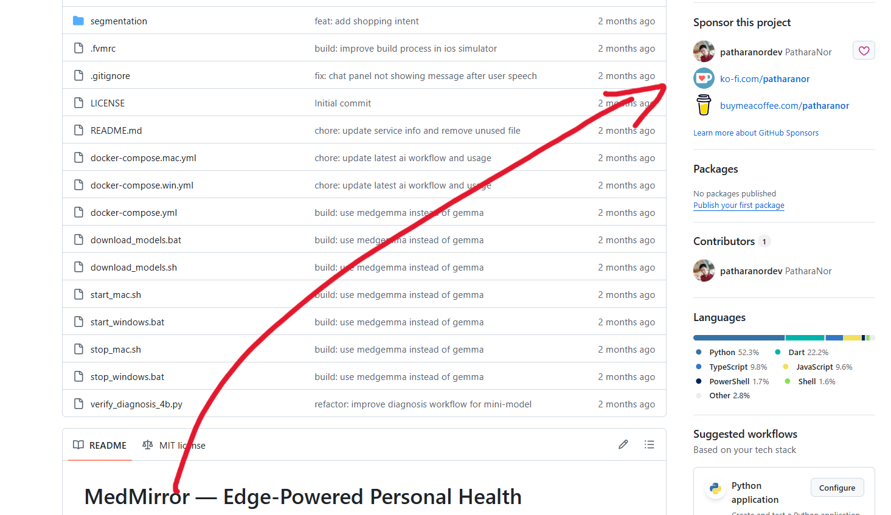

# MedMirror — Edge-Powered Personal Health

Developed as part of [The MedGemma Impact Challenge](https://www.kaggle.com/competitions/med-gemma-impact-challenge) on Kaggle, if you interested, you can read my [WriteUp](https://www.kaggle.com/competitions/med-gemma-impact-challenge/writeups/new-writeup-1771763757413) and support me by ***sponsor this project***

thank you.

---

> ---
> **Disclaimer**: The project name MedMirror was developed independently and is purely coincidental. The naming and development phases were conducted without prior knowledge of any existing platforms, trademarks, or entities sharing the same name.
>
> Please be advised that this project is strictly an independent work and has no affiliation, connection, or endorsement with any other existing projects, including but not limited to:
>
> - https://medreality.com/medmirror/
> - https://www.medmirrorr.com/
>
> We have provided this clarification to ensure transparency and to avoid any potential confusion with other entities operating under a similar name.
>
> Thank you for your interesting my prototype, I migrated the project to [rin](https://github.com/patharanordev/rin) instead.
>
> ---
