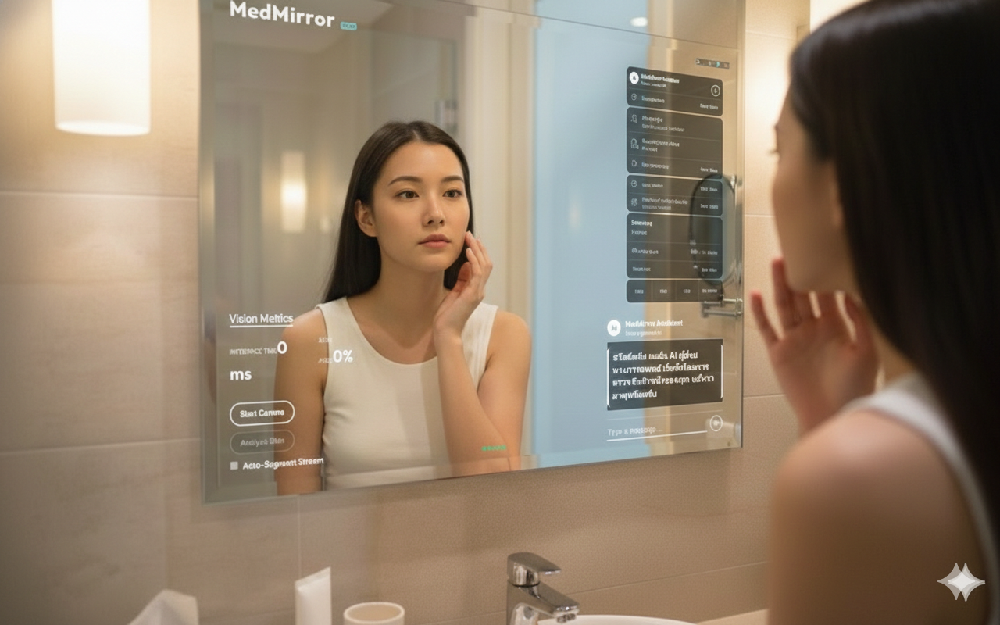
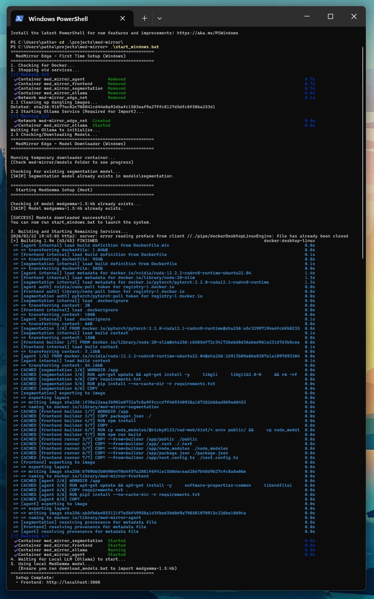
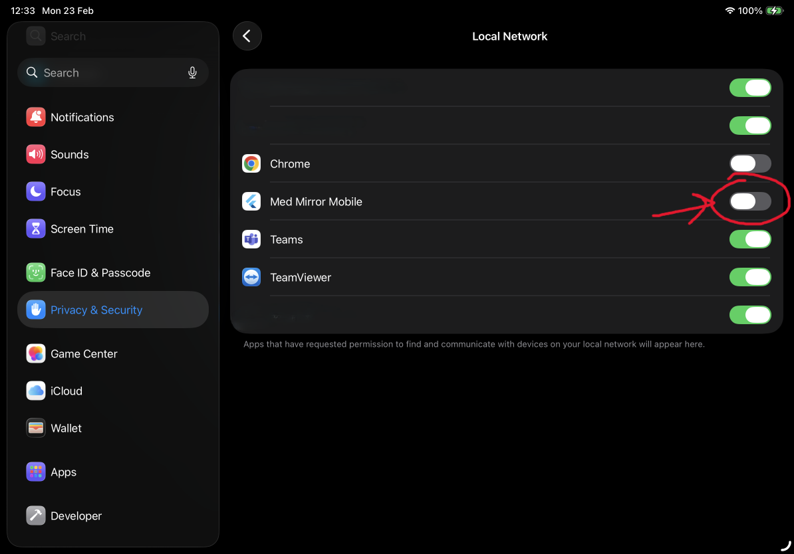
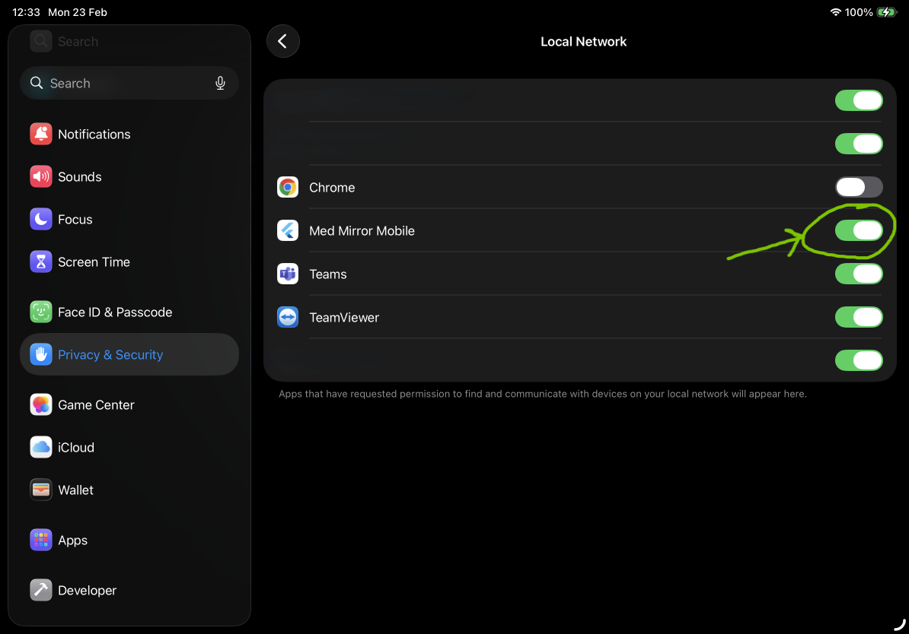
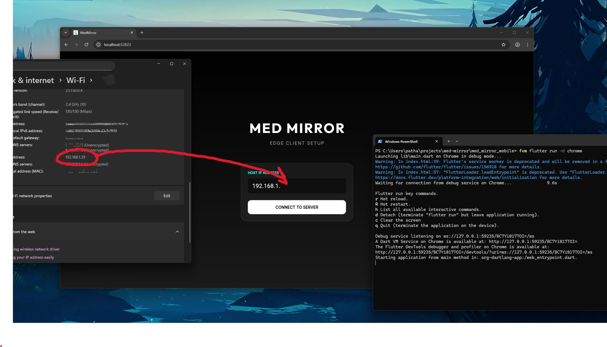

# MedMirror — Edge-Powered Personal Health



MedMirror is an intelligent, real-time medical analysis platform that transforms your screen into a diagnostic mirror. It combines computer vision (skin segmentation), local speech recognition, and multimodal LLMs to provide empathetic, localized dermatological advice.

---

## Table of Contents

- [Medical Agent](./agent/README.md)
- [Cross Platform Application](./med_mirror_mobile/README.md)
- [Skin Detection](./segmentation/README.md) (in-progress)
- [APIs](./apis/README.md)

---

## 🌟 Key Features

### 🩺 **Real-Time Skin Analysis**
- **Automatic Detection**: Instantly identifies various skin conditions (redness, lesions, acne) using the integrated SegFormer model.
- **Live Visualization**: See precise segmentation overlays on your video feed in real-time (0.5 - 1 FPS).

### 🗣️ **Talk to the Mirror (STT)**
- **Speech-to-Text**: Integrated transcription allowing you to talk directly to the mirror.
- **Hands-Free**: Talk naturally without pressing buttons. The system auto-detects speech and transcribes it instantly so you can focus on yourself.

### 🧠 **Empathetic Medical Interview**
- **Context-Aware AI**: The agent "sees" the skin analysis and asks relevant follow-up questions (symptom duration, pain levels, history).
- **Thai Language Support**: Fluent in Thai for approachable and localized medical advice.

### �️ **Visual Context Assurance**
- **Multimodal Awareness**: The "Eye" icon 👁️ signals when the AI has captured a clear image of your skin condition.
- **Zero-Wait Response**: The system initializes in the background, allowing you to start chatting the moment the page loads.

---

## 💻 Environment & Models

MedMirror is designed to run seamlessly on different hardware by choosing the best inference path:

### 🍎 macOS (Apple Silicon)
- **Model**: `medgemma-1.5-4b:latest` (Ollama)
- **STT**: `faster-whisper` (CPU)
- **Inference Mode**: **CPU-Optimized (Dockerized)**
- **Service**: Runs via `docker-compose.mac.yml`.

### 🪟 Windows (NVIDIA GPU)
- **Model**: `medgemma-1.5-4b:latest` (Ollama)
- **STT**: `faster-whisper` (CUDA/GPU)
- **Inference Mode**: **NVIDIA RTX 4080 Acceleration**
- **Service**: Runs via `docker-compose.win.yml` with CUDA 12.2 runtime.

### 🔧 Configuration via .env in `agent` folder
You can customize the agent language and STT model size in `.env.winos` or `.env.macos`:

```env
# Agent Language (th = Thai, en = English)
AGENT_LANGUAGE=th
```

Accuracy of STT model:

```env
# Whisper STT Model Size 
# Options: tiny, tiny.en, base, small, medium, large-v3
# WARNING: 'large-v3' is approx 3GB. Initial download will take time but is cached locally.
STT_MODEL_SIZE=tiny
```

Accuracy of definite diagnosis:

- `med_gemma_4b`: 4B for small edge computing
- `med_gemma_27b`: 27B for high accuracy

```env
# Choose workflow that match with your device
ACTIVE_WORKFLOW=med_gemma_4b
```

---

## 🚀 Getting Started

### 1. Prerequisites
- **Ollama**: Must be installed and running in the background. [Download here](https://ollama.com).
- **Hugging Face Token**: Required for MedGemma (gated model). Create a [Read Token here](https://huggingface.co/settings/tokens).
- **Docker Desktop**: For running the services.
- **NVIDIA Drivers & Container Toolkit** (Windows only): For GPU acceleration.

### 2. Download & Install Models
This step downloads necessary segmentation models and automatically converts/imports the MedGemma model.

#### **Windows**
1. Run the downloader script:
   ```powershell
   .\download_models.bat
   ```
   *Follow the prompts in the new window (if any) to paste your HF Token.*

#### **macOS / Linux**
1. Run the downloader script:
   ```bash
   ./download_models.sh
   ```
   *Follow the prompts.*

> **Note**: This script automatically performs the following for MedGemma:
> - Downloads weights from Hugging Face
> - Builds conversion tools (llama.cpp)
> - **Auto-converts** weights to GGUF format
> - Quantizes to optimize for performance (Q4_K_M)
> - Creates the Ollama model `medgemma-1.5-4b` ready for use.

#### **Mobile App Assets**

Download the mobile app assets from the [v0.0.1-mobileapp_assets release](https://github.com/patharanordev/med-mirror/releases/tag/v0.0.1-mobileapp_assets).

Please download assets below then copy/paste to `med-mirror/med_mirror_mobile/assets`.

Finally should look like this:

```sh
├───images
└───models
    └───vad
         ├───ort-wasm-simd-threaded.mjs
         ├───ort-wasm-simd-threaded.wasm
         ├───ort.wasm.min.js
         └───silero_vad_v5.onnx
```

### 3. Verify Installation
Ensure the model is correctly installed in Ollama:
```bash
ollama run medgemma-1.5:4b "Hello, I have a rash on my arm."
```
*(You should see a medical-context response)*


### 4. Launching

#### Backend

macOS:

```bash
docker-compose -f docker-compose.mac.yml up --build
```

*(Or use provided `start_mac.sh` scripts)*

Windows:

```powershell
docker-compose -f docker-compose.win.yml up --build
```



*(Or use provided `start_windows.bat` scripts)*

#### Frontend

> ---
> In `med_mirror_mobile` directory, install dependencies:
>
> ```bash
> sh refresh-ios.sh
> ```
> ---

For iPad:

```bash
fvm flutter run -d YOUR_DEVICE_ID_OR_NAME
```

Don't forget to allow local network in your iPad settings:

| Before | After |
| --- | --- |
|  |  |


Enjoy!!!

> ---
> In case you didn't have any device, please try on web instead:
>
> ```sh
> fvm flutter run -d chrome
> ```
>
> Then set IP address of your machine that run `agent` service (same network) to your client (web/iPad/etc...):
>
> 
>
> ---

---

## 🛠 Enhanced Architecture

### 1. Frontend (Flutter Cross-Platform)
- **Multi-Platform**: Built with Flutter (`med_mirror_mobile`) for cross-platform support. It runs seamlessly on Chrome (`fvm flutter run -d chrome`) and iOS via Xcode. (Android has not been tested yet).
- **Robust VAD**: Integrates Silero VAD directly in the app for accurate voice activity detection.
- **Required Assets**: Before running the app, ensure you download the necessary mobile app assets from the [v0.0.1-mobileapp_assets release](https://github.com/patharanordev/med-mirror/releases/tag/v0.0.1-mobileapp_assets).

### 2. Medical Agent (FastAPI + LangGraph)
- **Stateful Graph**: Manages conversation history, context, and image inputs.
- **Hybrid Streaming**: Supports both token-by-token streaming and bulk fallback.
- **Multimodal Handler**: Automatically formats text + image instructions for the Vision LLM.

### 3. Local STT Service (`faster-whisper`)
- **Privacy First**: All audio processed locally within the container.
- **Latency Optimized**: Using `tiny.en` model + beam size 1 for sub-200ms transcription.

### 4. Skin Segmentation (SegFormer)
- **Real-time Detection**: Uses a Transformers-based SegFormer model to identify skin areas at 0.5 FPS - 1 FPS.
- **Persistent Cache**: Models are cached to ensure fast restarts and offline capability.

### 5. LLM Backend (Ollama)
- **Unified API**: All agents communicate via the Ollama OpenAI-compatibility layer (`/v1`).
- **Flexible Models**: Easily swappable models (Gemma 3, MedGemma) via environment variables.

---

## 🧪 Verification
Run the automated streaming test to verify backend health:
```bash
python agent/tests/test_streaming.py
```

---

## � Issues Resolved

### Recent Fixes
- **Resilience**: Fixed "infinite typing" by implementing callback config propagation in LangGraph.
- **UI**: Added animated status tray (Mic, Ear, Brain, Eye).
- **Docker**: Split builds for optimized Windows (CUDA) vs Mac (CPU) images.

### Previous Improvements
- **Mirror Fix**: Both live preview and captured frames are now horizontally flipped to match user intuition.
- **Gemma 3 Migration**: Switched to the Gemma 3 family for superior medical text comprehension and multimodal reasoning.

## Contributing

### Tracing

To monitor and debug your agentic workflows, MedMirror supports both **Langfuse** (recommended) and **LangSmith**.

- [**Langfuse**](https://github.com/langfuse/langfuse): Our primary tracing and observability platform. It's open source LLM engineering platform: LLM Observability, metrics, evals, prompt management, playground, datasets. Integrates with OpenTelemetry, Langchain, OpenAI SDK, LiteLLM, and more. To enable, add your `LANGFUSE_PUBLIC_KEY`, `LANGFUSE_SECRET_KEY`, and `LANGFUSE_BASE_URL` to your `.env` file. Please refer to [observability](./observability/README.md).

   

- [**LangSmith**](https://smith.langchain.com/): is also supported natively via LangChain. If you prefer using LangSmith, simply add your `LANGSMITH_API_KEY` and set `LANGSMITH_TRACING=true` in your `.env` file.

   
