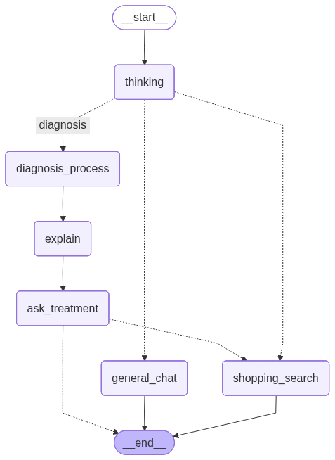
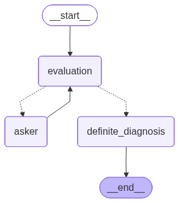
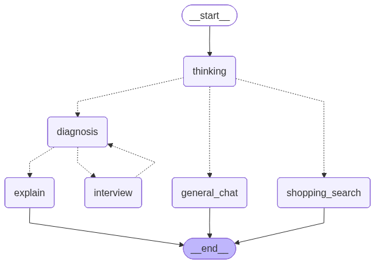
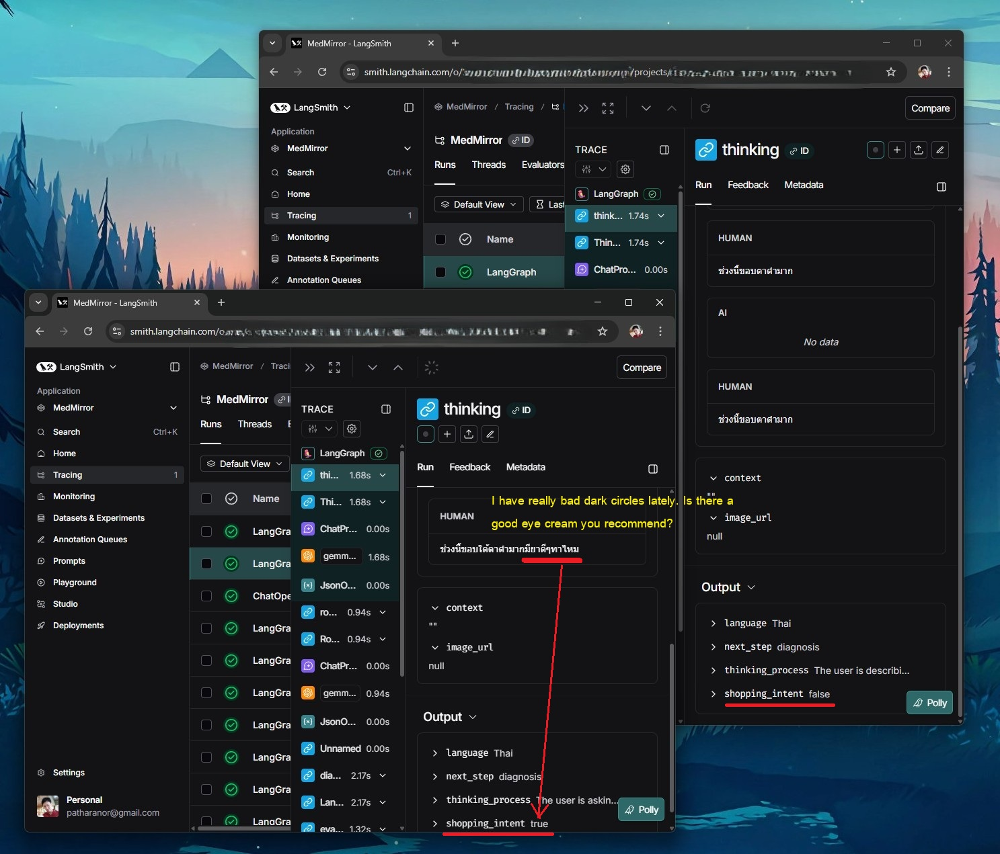

# Medical Agent

This directory contains the Python-based medical AI agent that runs via FastAPI and LangGraph.

## Workflows & Node Explanation

The agent supports two distinct workflows tailored for different model sizes and computational resources. You can switch between them by setting the `ACTIVE_WORKFLOW` environment variable in your `.env` file.

## `med_gemma_4b` Workflows & Node Explanation

The `med_gemma_4b` architecture is structured through LangGraph to manage intent routing, casual conversation, medical data extraction, diagnosis, and product recommendation using three specific LLMs: the Main LLM (`gemma3n:e4b`), the Diagnosis LLM (`medgemma-1.5:4b`), and the Tool Call LLM (`qwen3:4b`).

### Main Workflow Nodes (`app/workflow/med_gemma_4b/graph.py`)
- **`thinking` (ThinkingNode)**: Evaluates user input and routes to general chat, diagnosis, or shopping search. Uses the **Main LLM**.
- **`general_chat` (GeneralChatNode)**: Handles casual conversation securely and concisely. Uses the **Main LLM**.
- **`diagnosis_process` (Diagnosis Subgraph)**: Specialized subgraph (below) dedicated to conducting medical interviews and diagnosing. 
- **`explain` (ExplainNode)**: Takes the final clinical diagnosis output from `diagnosis_process` and transforms it into a patient-friendly explanation. Uses the **Main LLM**.
- **`ask_treatment` (AskTreatmentNode)**: Proactively checks if the user wants recommendations for treatments, medicine, or relevant medical centers. If YES, it sets `shopping_intent` to True. Uses the **Main LLM**.
- **`shopping_search` (ShoppingSearchNode)**: Uses the `tavily-python` internet search tool to recommend actual products based on intended conditions. Uses the specialized **Tool Call LLM**.

### Diagnosis Subgraph Nodes (`diagnosis_process`)
When entering the medical diagnosis phase, the agent routes to a dedicated Subgraph:
- **`evaluation` (EvaluationNode)**: Continuously evaluates if the medical interview state is complete. Routes to `asker` if more information is needed, or `definite_diagnosis` if complete. Uses the **Main LLM**.
- **`asker` (AskerNode)**: A Human-in-the-Loop (HITL) node that forms natural questions to collect missing medical context (symptoms, duration, etc.) and interrupts to wait for user response. Uses the **Main LLM**.
- **`definite_diagnosis` (DefiniteDiagnosisNode)**: The clinical reasoning engine calculating the final diagnosis once all required information has been collected. Uses the specialized **Diagnosis LLM**.

---

## Model Configuration

### 1. `med_gemma_4b` (Default / Edge)
Optimized for speed and lower resource usage (e.g., local laptops, edge devices).
- **Workflow Logic**: `app/workflow/med_gemma_4b/graph.py`
- **Recommended Models**:
  - Main LLM: `gemma3n:e4b` (or similar lightweight model)
  - Diagnosis LLM: `medgemma-1.5:4b`
  - Tool Call LLM: `qwen3:4b`

**Configuration (.env):**
```bash
# ------------------------------------------------------------------------------
# App Configs

# Choose workflow that match with your device
ACTIVE_WORKFLOW=med_gemma_4b

# STT Settings (Whisper model: tiny, tiny.en, base, base.en, small, small.en, medium, large-v2, large-v3)
# Use ".en" suffix for English-only models (faster but English only)
STT_MODEL_SIZE=large-v3

# Agent Language (th = Thai, en = English)
AGENT_LANGUAGE=th

# ------------------------------------------------------------------------------
# LLM

LLM_BASE_URL=http://ollama:11434/v1
LLM_API_KEY=ollama

# For MedGemma on small edge computing
LLM_MODEL=gemma3n:e4b
LLM_MODEL_DIAGNOSIS=medgemma-1.5:4b
LLM_MODEL_WITH_TOOL_CALL=qwen3:4b

# # For MedGemma with high accuracy
# LLM_MODEL=qwen3:8b
# LLM_MODEL_DIAGNOSIS=medgemma:27b

# ------------------------------------------------------------------------------
# Tracing (Supports both, priority depends on env vars)

# Langfuse (Explicitly initialized in app/core/config.py)
LANGFUSE_SECRET_KEY="sk-lf-be...19a07"
LANGFUSE_PUBLIC_KEY="pk-lf-ef...bfc9"
LANGFUSE_BASE_URL="http://localhost:33000"

# LangSmith (Implicitly supported via LangChain env vars)
LANGSMITH_TRACING=true
LANGSMITH_ENDPOINT=https://api.smith.langchain.com
LANGSMITH_API_KEY=lsv2_pt_f5...60e92
LANGSMITH_PROJECT="MedMirror"

# ------------------------------------------------------------------------------
# Tools

# Tavily
TAVILY_API_KEY=tvly-dev-1BdX...MAnS
```

| Workflow for MedGemma1.5:4b | Diagnosis Subgraph |
|-----------------------------|--------------------|
| | |

### 2. `med_gemma_27b` (High Accuracy)

> ---
> **NOTE**: This part I didn't test with `medgemma:27b` yet. It's my future plan to test it.
>
> ---

Optimized for deep medical reasoning and higher accuracy. Requires significantly more VRAM.
- **Workflow Logic**: `app/workflow/med_gemma_27b/graph.py`
- **Recommended Models**:
  - Main LLM: `gemma3` (or larger)
  - Diagnosis LLM: `medgemma:27b`
  - Tool Call LLM: `qwen3:8b`

**Configuration (.env):**
```bash
ACTIVE_WORKFLOW=med_gemma_27b

# LLM Server Configuration
LLM_BASE_URL=http://localhost:11434/v1
LLM_API_KEY=ollama

# Model Configuration
LLM_MODEL=gemma3
LLM_MODEL_DIAGNOSIS=medgemma:27b
LLM_MODEL_WITH_TOOL_CALL=qwen3:8b

# Add other environment variables (STT, Tavily, LangSmith) as shown in the 4B configuration.
```

| Workflow for MedGemma:27b |
|---------------------------|
|  |


## Requirements

- **Python 3.12+**
  - **Critical**: You must use Python 3.12 or newer. 
  - Using older versions (3.10/3.11) may cause the error: `Called get_config outside of a runnable context` when using LangGraph's human-in-the-loop features (interrupts).

## Running Locally

1. Create a virtual environment:
   ```bash
   python3.12 -m venv venv
   source venv/bin/activate  # or venv\Scripts\activate on Windows
   ```

2. Install dependencies:
   ```bash
   pip install -r requirements.txt
   ```

3. Run the agent:
   ```bash
   uvicorn main:app --reload --port 8001
   ```

### Mock Endpoints (Local Testing)
To test the frontend UI (like the product recommendation carousel) without hitting the LLM or Tavily API every time, you can utilize the streaming mocks provided in the `mocks/` directory. This is particularly useful for rapid iterations on the mobile app.

## Docker

The provided Dockerfiles (`Dockerfile.win`, `Dockerfile.mac`) are already configured to use Python 3.12.

## Shopping Intent Detection

The agent now features smart **Shopping Intent Detection** powered by the LLM (`gemma3n:e4b` or routing model).



### How it works:
1.  **Thinking Node**: Detects if the user explicitly asks for products, medicine, or treatment (e.g., "I need a cream for this rash").
2.  **Evaluation Node**: Continuously monitors the diagnosis interview for shopping intent.
3.  **State Update**: Sets `shopping_intent=True` in the `AgentState`.
4.  **Automatic Routing**:
    -   If `shopping_intent` is **True**, the agent automatically transitions to **Shopping Search** after the diagnosis/explanation is complete.
    -   This node uses the `tavily-python` tool to fetch live product recommendations using your `TAVILY_API_KEY`.
    -   If **False**, the session ends normally.

This replaces the previous "Human-in-the-Loop" question node, providing a smoother and faster user experience.

## Testing

### Functional/Unit Tests

> ---
> **NOTE**: Some test scripts require Ollama to be running locally. Make sure Ollama is running before running the tests.
>
> ---

Install python3.12:

```bash
python3.12 -m venv .venv

# for winos
.\.venv\Scripts\Activate.ps1

# for linux
source .venv/bin/activate
```

Install pytest with dependencies:

```bash
pip install langchain langchain_openai pydantic_settings pytest pytest-asyncio
```

Ex. run tests:

```bash
pytest tests/test_agent_struct_output.py
```
